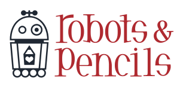

MonaLisaMac
===========

This is the source code for the foyer installation in our Calgary office. The eyes of our robot logo, displayed on a TV, would follow people as they entered and were tracked with a Kinect.

This repo is no longer maintained and is being shared as-is for the sake of it.

Installation
------------

`brew install libtool libusb`

You must install these three dependencies in the correct order:

1. OpenNI
2. SensorKinect
3. NITE

`mkdir ~/Kinect && cd ~/Kinect`

Download the latest 1.x (not 2.x+) versions of OpenNI and NITE [here](http://www.openni.org/openni-sdk/openni-sdk-history-2/). Move these into the new Kinect folder and then `sudo ./install.sh` OpenNI.

Download SensorKinect [here](https://github.com/avin2/SensorKinect). Navigate to the Bin directory and expand the Mac .bz2 file. Run `sudo ./install.sh`.

Install NITE with (surprise) `sudo ./install.sh`.

Copy the .xml files (there should be three of them) from NITE/data to SensorKinect/data.

Restart your computer and connect your Kinect. That's fun to say.

Run `cd ~/Kinect/nite-bin-macosx-v1.5.0.2/Samples/Bin/Release/ && ./Sample-PointViewer` to test that everything is working properly.

Author
------

- [Brandon Evans](https://github.com/interstateone)

Contact
-------

Follow Robots & Pencils on Twitter ([@robotsNpencils](https://twitter.com/robotsNpencils))

License
-------

Includes modified [CocoaOpenNI](https://github.com/johnboiles/CocoaOpenNI) code by John Boiles.

Because this software relies on an OpenNI .dylib, which is GPLv3 licensed, this software is also GPLv3 licensed for compliance in the event it is ever made public or distributed.

See the LICENSE file for more information.

